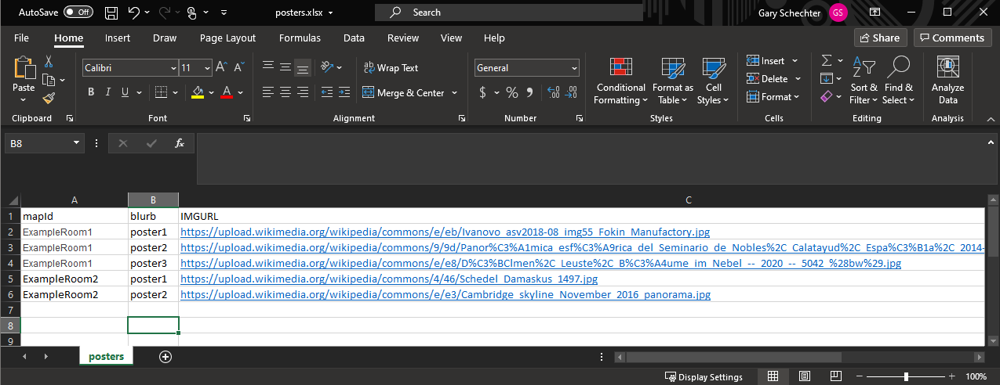
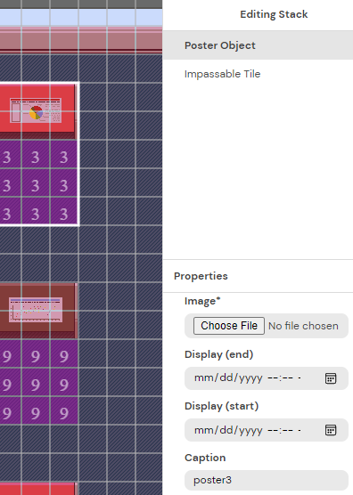

> :warning: **I am an inexperienced python developer,  my primary code base is more C based languages like `PHP` and `C#`** I am very open to feedback.  My primary goals were to write this quickly, and as easy to read, over any n-th performance gains. That way if I or another less experinced programmer needed to make changes later it would be easy to understand.


 ---
>##### At [Parthenon Management Group](https://parthenonmgmt.com/), we specialize in management and facilitation for professional scientific societies. In preparation for one of our client's virtual conference utilizing GatherTown it was realized that we need a way for our Project Managers to bulk update the posters in the poster session rooms compared to the tedious task in the GatherTown MapMaker. If you are curious about more of what PMG does and if we can help your society please reach out to us on our website.
> ~Gary Schechter


# GatherTown Poster Updater From XLSX (PYTHON)

Easily bulk update posters in GatherTown from XLSX file.

## How It Works

1. Python Script - built for Python 3.6 with these libraries 
    * OPENPYXL
    * REQUSTS
    * JSON
    * COLORAMA
    * CONFIGPARSER
    * OS PATH
2. Creates a basic config file if missing.  
3. Won't run if configured XLSX is missing.  XLSX File has 3 columns for `mapid`/`roomname`, `blurb`/`caption`, and `url`


> :warning: **Make sure to have CORS on the hosting server set to allow the origin** [GatherTown explains this in their API documentation](https://www.notion.so/EXTERNAL-Gather-http-API-3bbf6c59325f40aca7ef5ce14c677444#fbba4d665f814186a6c82523203b91af).
4. Let's you over-ride the `apikey` and `spaceid` from the config.
5. Internally it rebuilds XLSX file into something that can that be parsed easier and more efficiently to consolidate the API calls.
    ```python 
    [{
    'mapid': 'ExampleRoom1',
    'posters': [{
            'blurb': 'poster1',
            'url': 'picture3.jpg'
        },
        {
            'blurb': 'poster2',
            'url': 'picture4.jpg'
        },
        {
            'blurb': 'poster3',
            'url': 'picture5.jpg'
        }]
	}, {
    'mapid': 'ExampleRoom2',
    'posters': [{
        'blurb': 'poster1',
        'url': 'picture6.jpg'
    }, {
        'blurb': 'poster2',
        'url': 'picture7.jpg'
    }]
6. Get's the map data from gatherTown's getMap endpoint, and searches on the `blurb`/`caption` for the posters it update
   * Set under the showmore toggle on the map maker.



7. Updates the poster `image` and `preview` URLs with the one from the excel file.
8. Sends the updated map data with gatherTown's setMap endpoint.

### I used `pyinstaller` to create a distributable exe for my colleagues to not have to load and configure a python runtime environment. ###
    pyinstaller -f pyGatherXLSPoster.py
